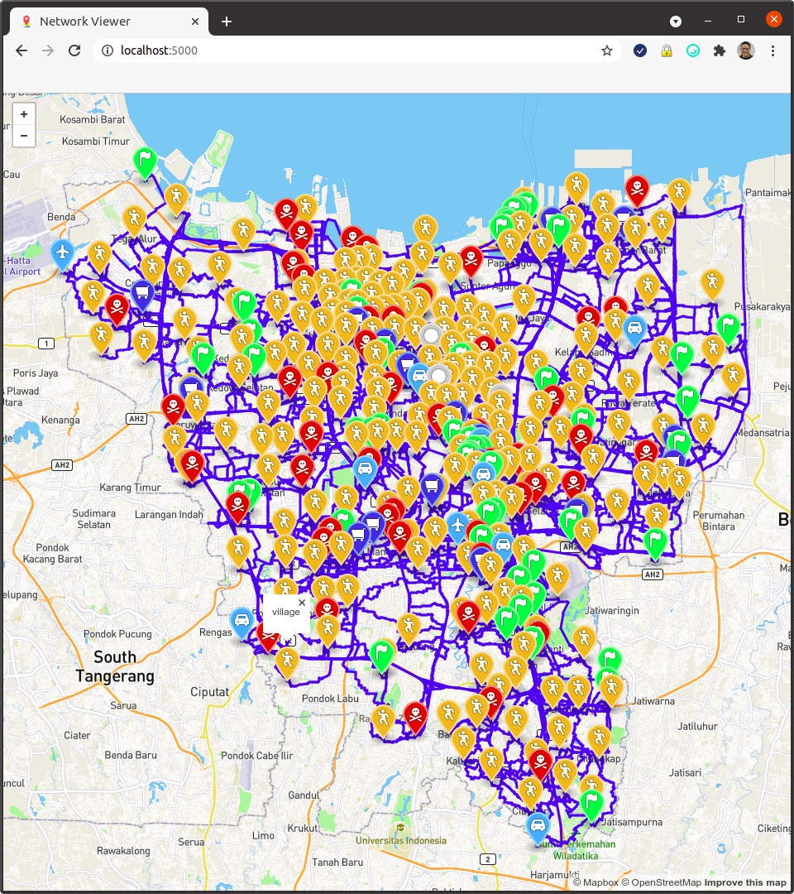
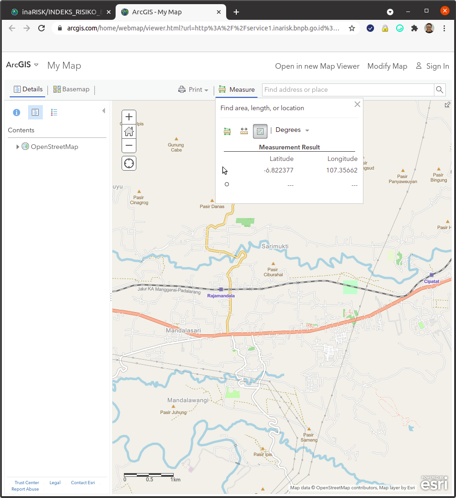

# Respond OR Subnetwork Generation

Respond OR subnetwork generation from OpenStreetMap data



## Prerequisites

For data preparation:

* [OsmToRoadGraph](https://github.com/AndGem/OsmToRoadGraph) (to generate graph from `*.osm`)
* [osmconvert64](http://m.m.i24.cc/osmconvert64) (to convert `*.pbf` to `*.osm`)

To run the subnetwork generation & visualization:

* Docker >= 19.x
* Docker-compose >= 1.26.x
* [Mapbox Access Token](https://docs.mapbox.com/help/getting-started/access-tokens/) (optional. To visualize subnetwork over map) 

These files are required as input:

1. **Point of Interest (PoI) location file**. A CSV file where each rows contain `name,type,lat,lon` and `type` is one of `{'village','shelter','depot'}` (other than that will be grouped as `others`). Example: `example.zip/jakarta_locations.csv`
2. **[OpenStreetMap](https://www.openstreetmap.org) file**. An `*.osm` or `*.pbf` file that includes all PoIs/locations (example [Jakarta.pbf](http://openstreetmap.id/data/pbf/Jakarta.pbf)) which needs to be converted to `*.pycgrc` & `*_contracted.json` files using [OsmToRoadGraph](https://github.com/AndGem/OsmToRoadGraph). Example: `example.zip/jakarta.pycgrc` & `example.zip/jakarta_contracted.json`
3. **Risk layer image**. A PNG from [INARISK.](http://service1.inarisk.bnpb.go.id:6080/arcgis/rest/services/inaRISK). Example: `example.zip/jakarta_flood_risk_layer_inarisk.png`
4. **Pixel-to-coordinates pairs data**. Minimal 3 samples of pixel-to-coordinates pairs of the risk layer image (eg. `[199, 151] => [-6.124142, 106.656685]`). We can get these samples by comparing the risk layer with the actual map from INARISK eg. `example.zip/jakarta_inarisk.png`

Tips:

* To make sure the OSM data & Risk Layer Image covers the whole Point of Interests, we can use tool like [Umap](http://umap.openstreetmap.fr/) to map lat/lon to a map
* The INARISK's ArcGIS application has a tool to show lat/lng of a point in a map (from the map click Measure > Location)



## Demo

To get the feel of how the program works, complete example input data has been provided in [example.zip](example.zip). Follow this steps below to generate the subnetwork of Jakarta's Flood disaster (commands to be run on Linux bash):

1. Extract `example.zip`: `unzip example.zip`
2. Copy `config.ini.example` to `config.ini` (set `mapbox_access_token` to allow visualization)
3. Generate subnetwork: `docker-compose run -v ${PWD}/example:/data -v ${PWD}/config.ini:/config.ini respondor python main.py /data/jakarta_input.json`
4. Run subnetwork web viewer on browser: `docker-compose run -v ${PWD}/example:/example -v ${PWD}/config.ini:/config.ini -p 5000:5000 -d respondor python viewer/app.py /example/jakarta_locations.csv /example/jakarta_subnetwork.pycgrc`
5. View/visualize subnetwork by opening http://localhost:5000 on browser
6. To shutdown: `docker-compose down -v`

> The subnetwork generation process is computationally heavy. Depends on the size of the OSM file, the number of PoIs, and number of CPU cores, it could take minutes-hours. 

## Data Preparation

First, get OpenStreetMap file (`*.osm` or `*.pbf`) that covers the expected area. If it is `*.pbf`, use [osmconvert64](http://m.m.i24.cc/osmconvert64) to convert it to `*.osm`:

```bash
~/osmconvert64 jakarta.osm.pbf -o=jakarta.osm

# the result will be jakarta.osm
```

Then generate `*.pycgr/*.pycgrc` file and `*_contracted.json` (networkx JSON graph) using [OsmToRoadGraph](https://github.com/AndGem/OsmToRoadGraph)

```bash
git clone https://github.com/AndGem/OsmToRoadGraph
cd OsmToRoadGraph
pip3 install networkx
python run.py -f jakarta.osm -n c -c --networkx

# the result will be jakarta.pycgrc and jakarta_contracted.json
```
If you get error below, it means the graph can not be contracted:

```bash
File "/path/OsmToRoadGraph/graph/contract_graph.py", line 98, in _find_edges_to_merge
    assert False
```

Run this command instead and use `*.pycgr` and networkx `*.json`:

```bash
python run.py -f jakarta.osm -n c --networkx

# the result will be jakarta.pycgr and jakarta.json
```

## Input Description

The main input in for the subnetwork generation the example, `jakarta_input.json` is as follow:

```json
{
    "name": "jakarta",
    "output_dir": "example",
    "network_pycgr_file": "example/jakarta.pycgrc",
    "poi_file": "example/jakarta_locations.csv",
    "network_json_file": "example/jakarta_contracted.json",    
    "risk_layer_file": "example/jakarta_flood_risk_layer_inarisk.png",
    "risk_coordinates_samples": [
        [[199, 151], [-6.124142, 106.656685]],
        [[72, 392], [-6.288732, 106.569526]],
        [[355, 463], [-6.336779, 106.763544]]
    ]
}
```

Input fields description:

* `name`: name of the area. Will be used as the base name of table and output files
* `output_dir`: relative/absolute path of the output directory
* `network_pycgr_file`: relative/absolute path of the original pycgr/pycgrc file
* `poi_file`: relative/absolute path of the original point of interests CSV file
* `network_json_file`: relative/absolute path of the original networkx JSON file
* `risk_layer_file`: relative/absolute path of the original risk layer image file from INARISK
* `risk_coordinates_samples`: array of array of risk layer pixel-coordinates pairs (min. 2 pairs)

If we don't want to generate network risk, just remove the fields eg:


```json
{
    "name": "jakarta",
    "output_dir": "data/jakarta",
    "network_pycgr_file": "data/jakarta/jakarta.pycgrc",
    "poi_file": "data/jakarta/jakarta_locations.csv",
    "network_json_file": "data/jakarta/jakarta_contracted.json"
}
```

## Output Description

The output of the end-to-end process will be:

* `*_locations.csv`: the original input file will be appended with 2 new columns: node id & type node id (node id reindexed per node type)
* `*_subnetwork.pycgr` or `*_subnetwork.pycgrc`: subgraph/subnetwork/routes of the nodes in `*_locations.csv`
* `*_subnetwork.pycgr_risk` or `*_subnetwork.pycgrc_risk`: routes with risk value {0.0 ... 1.0}
* `*_subnetwork.pycgr_node_risk` or `*_subnetwork.pycgrc_node_risk`: node ids with risk value {0.0 ... 1.0}

More information regarding the file format can be found below.

## File formats

### Locations/PoIs

Definition of columns in `*_locations.csv`:

1. name: location name
1. type: location type (village, shelter, depot)
1. latitude: geolocation latitude (-90.0 - 90.0)
1. longitude: geolocation longitude (-180.0 - 180.0)

After the end-to-end process ended, 2 new columns will be appended:

1. node id: node id in `*.pycgr`/ `*.pycgrc`
1. type node id: node id that has been reindexed per type (sequence restarted per type)

### Graph/Routes

Definition of columns in `*.pycgr` / `*.pycgrc`:

The file begins with a header (some lines with a # character).

Then, two lines follow that contain the number of nodes and the number of edges. After this, two larger blocks follow. In the first block, the nodes are being described, and in the latter the edges are described. The first block consists of `number of nodes` many lines, and the second block consists of `number of edges` many lines.

The nodes of the graph are described by the following three parameters. Each node's data is stored in one line, and the parameters are separated by a space:
* id: the node id (used later in the part where edges are to describe which nodes are connected by an edge)
* lat: latitude of the node
* lon: longitude of the node

Edges of the graph are described by 6 parameters. Each edge is stored in one line, and the parameters are separated by a space:

* source_node_id: the node id (see above) from which the edge originates
* target_node_id: the node id (see above) to which the edge leads to
* length: the length of the edge in meters (approximated)
* street_type: one of the OSM highway types (see: https://wiki.openstreetmap.org/wiki/Key:highway)
* max_speed: maximum allowed speed (if exists) in km/h [note: if no max speed is found a default value will be used]
* bidirectional: indicates if an edge is bidirectional. The value is 0 if it is a unidirectional road (from source_node_id to target_node_id), and otherwise it is 

### Network Risk

Definition of columns in `*.pycgr_risk` / `*.pycgrc_risk`:

1. source_id: node id of the source node (corresponding to pycgr/pycgrc input file)
1. target_id: node id of the source node (corresponding to pycgr/pycgrc input file)
1. risk: risk value (float) ranging from 0.0 (safe) … 1.0 (dangerous)
1. length: the length of the edge in meters (approximated)
1. street_type: one of the OSM highway types (see: https://wiki.openstreetmap.org/wiki/Key:highway)
1. max_speed: maximum allowed speed (if exists) in km/h [note: if no max speed is found a default value will be used]
1. bidirectional indicates if an edge is bidirectional. The value is 0 if it is a unidirectional road (from source_node_id to target_node_id), and otherwise it is 

### Node Risk

Definition of columns in `*.pycgr_node_risk` / `*.pycgrc_node_risk`:

1. node_id: node id of the source node (corresponding to pycgr/pycgrc input file)
1. risk: risk value (float) ranging from 0.0 (safe) … 1.0 (dangerous)
